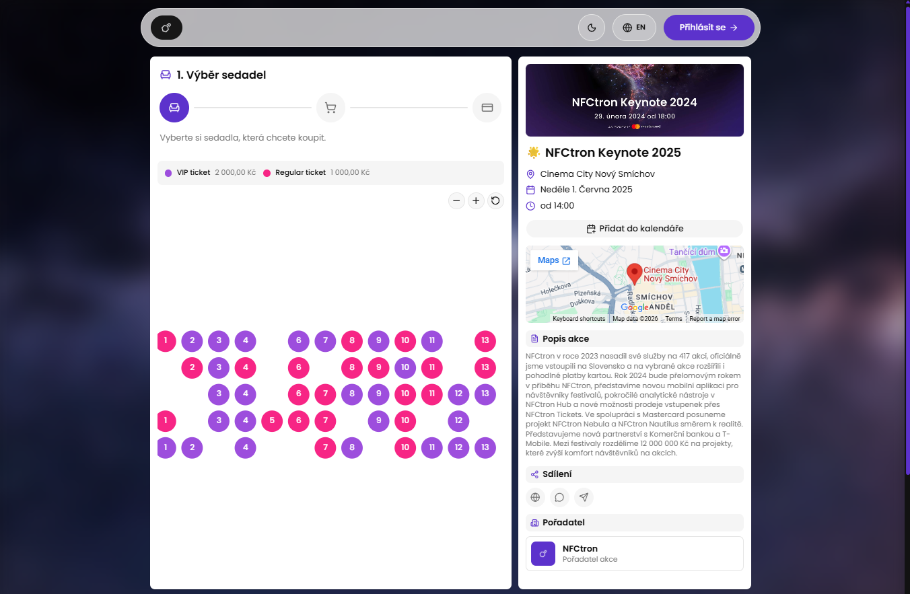
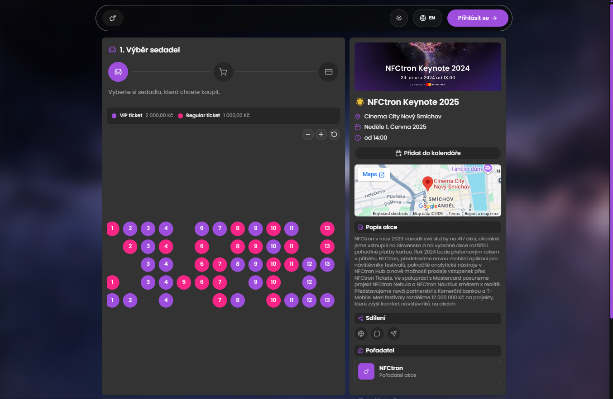
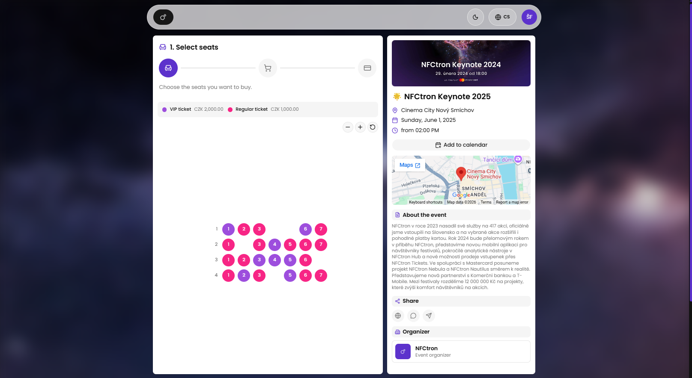
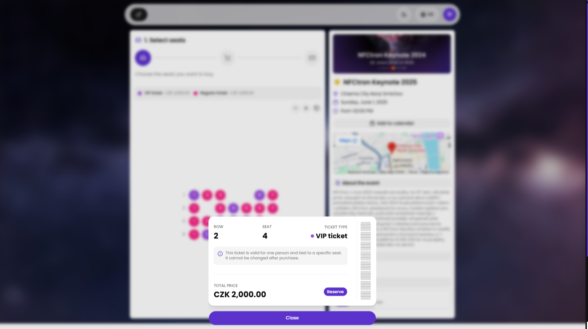
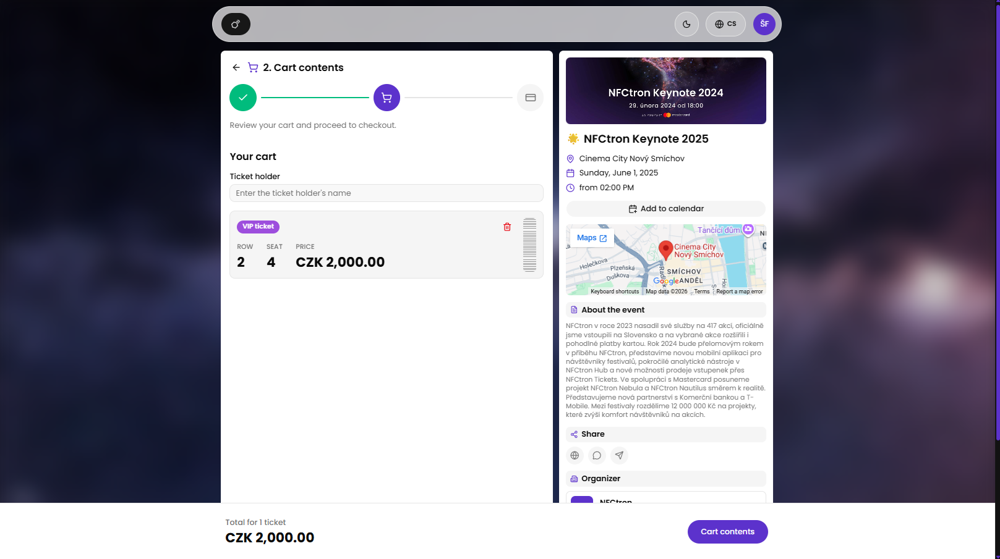
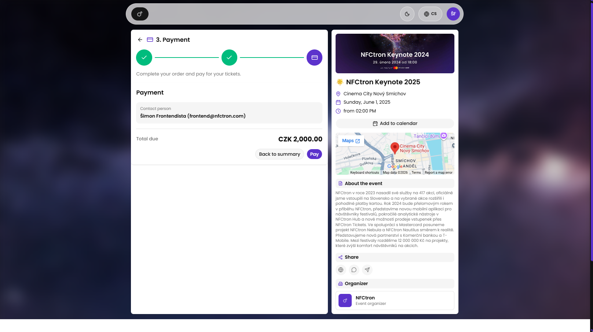
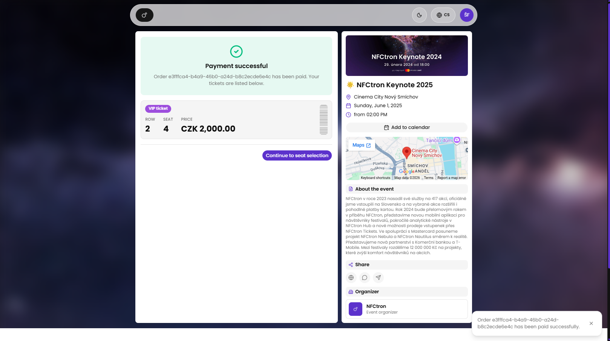
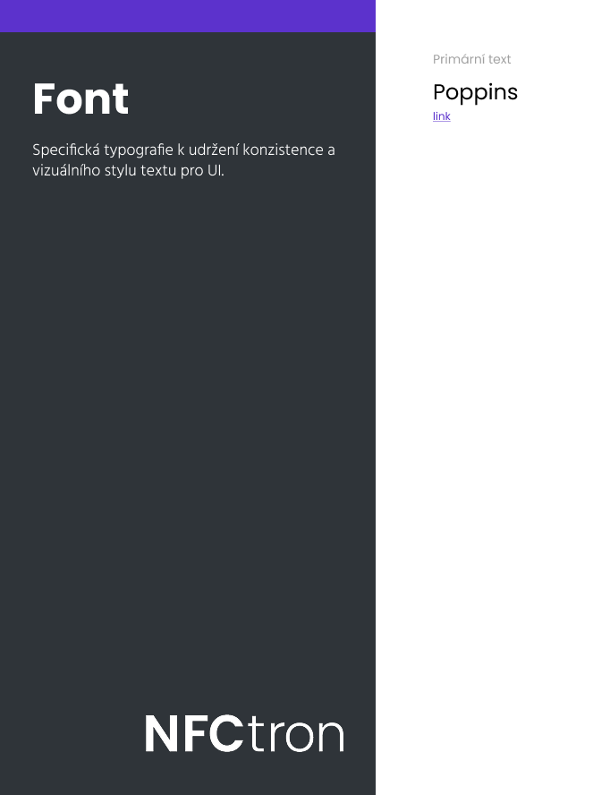
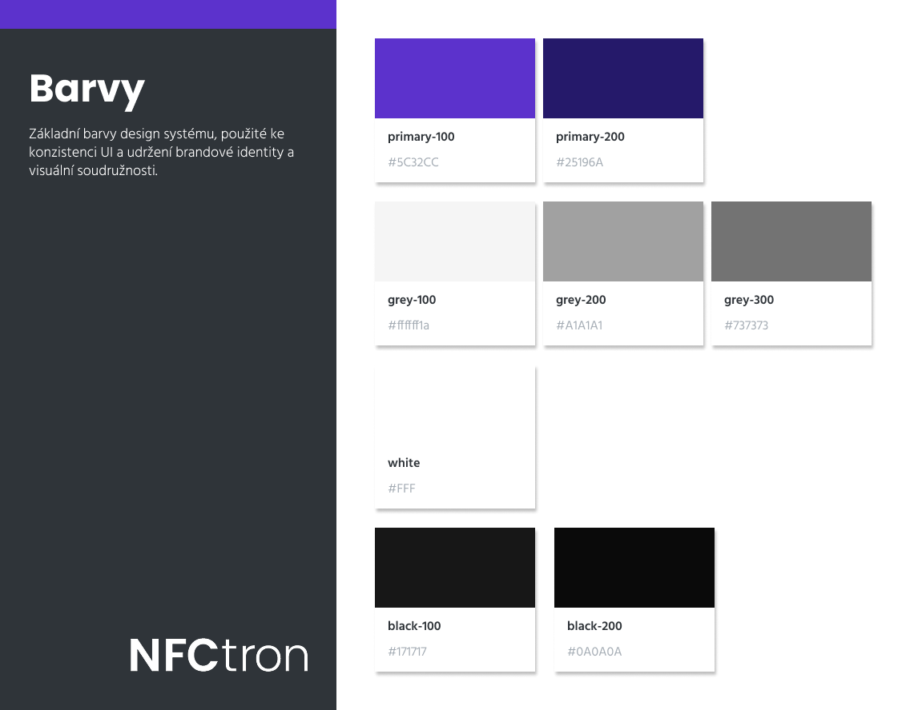

# NFCtron Seating — řešení case study

Aplikace pro nákup vstupenek na akci: detail akce, interaktivní mapa sedadel, košík a
třífázový checkout (výběr sedadel → souhrn → platba). Postavena nad zadáním v
[ASSIGNMENT.md](./ASSIGNMENT.md), API popsané v [API.md](./API.md).

<p align="center">
  
  
</p>

## Průběh nákupu

**1. Výběr sedadel**
<p align="center"></p>

**2. Rezervace vstupenky**
<p align="center"></p>

**3. Obsah košíku**
<p align="center"></p>

**4. Platba**
<p align="center"></p>

**5. Potvrzení platby**
<p align="center"></p>

## Funkce

### Ze zadání

- Detail akce (obrázek, název, popis, datum/čas, místo s vloženou mapou) v `EventCard`.
- Mapa sedadel v `SeatMap`/`Seat` — sedadla rozložená podle skutečné `seatRow`/`place`
  pozice (grid respektuje mezery v číslování, ne pořadí v API odpovědi), barevně odlišená
  podle typu vstupenky, s legendou a zoom/pan ovládáním.
- Přidávání/odebírání sedadel z košíku (`useCart` hook), s potvrzovacím dialogem při
  odebrání z přehledu košíku.
- Třífázový checkout (`CheckoutStepper`) — výběr sedadel, souhrn objednávky, platba —
  s navigací zpět i mezi již navštívenými kroky.
- Přihlášení nebo dokončení objednávky jako host (`GuestCheckoutForm`), bez nutnosti
  registrace.
- Vytvoření objednávky přes `/order` API a zobrazení výsledku (toast s potvrzením nebo
  chybovou hláškou).

### Navíc

- **Perzistentní přihlášení** — po přihlášení se uživatel uloží do cookie (`useAuth`),
  takže se nemusí přihlašovat opakovaně.
- **Přidání do kalendáře** — tlačítko v `EventCard` generuje Google Calendar odkaz
  s předvyplněnými údaji o akci.
- **Multijazyčnost (CS/EN)** — vlastní i18n systém (`useLocale` + slovník v
  `src/lib/i18n`), přepínač v navigaci, formátování data i měny podle zvoleného jazyka.
- **Světlý/tmavý režim** — přepínač v navigaci, uložený v `localStorage`, respektuje
  systémovou preferenci při první návštěvě.
- Vstupenka v drawer detailu i v košíku stylizovaná jako skutečná vstupenka (perforace,
  barcode pruh).

## Spuštění

```bash
npm install
npm run dev
```

Aplikace běží proti veřejnému API na `nfctron-frontend-seating-case-study-2024.vercel.app`
(viz [API.md](./API.md)) — žádná vlastní API konfigurace není potřeba. Pro přihlášení
použijte testovací účet z [API.md](./API.md), nebo pokračujte jako host.

```bash
npm run build     # produkční build (tsc + vite build)
npm run lint       # ESLint
npm run preview    # náhled produkčního buildu
```

## Technologie

React 19, TypeScript, Vite, Tailwind CSS v4, Base UI (headless primitivy pod shadcn
wrappery v `src/components/ui`), TanStack React Query, Zod (runtime validace API
odpovědí), `react-zoom-pan-pinch` (zoom/pan mapy sedadel).

## Branding

Design systém navržený ve Figmě před samotnou implementací — paleta barev a typografie
použité ke konzistenci UI a udržení brandové identity (promítnuto do `src/App.css`).

<p align="center">
  
  
</p>

**Font** — [Poppins](https://fonts.google.com/specimen/Poppins), primární text napříč
celým UI (`--font-sans`, načtené z Google Fonts).

## Struktura

```
src/
  api/            # fetch klienti (event, tickets, order, auth) + sdílený ApiError
  components/     # feature komponenty (SeatMap, CheckoutStepper, EventCard, ...)
  components/ui/  # shadcn/Base UI primitivy
  hooks/          # useCart, useAuth, useLocale, useTheme, ...
  lib/            # formátování, i18n slovník, utility funkce
  types/          # typy odvozené ze Zod schémat
```

Poznámky k průběhu práce a rozhodnutím jsou v [COMMENTS.md](./COMMENTS.md).
